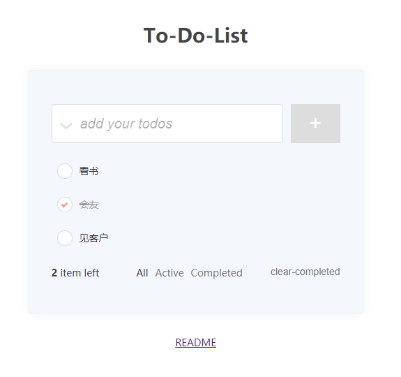
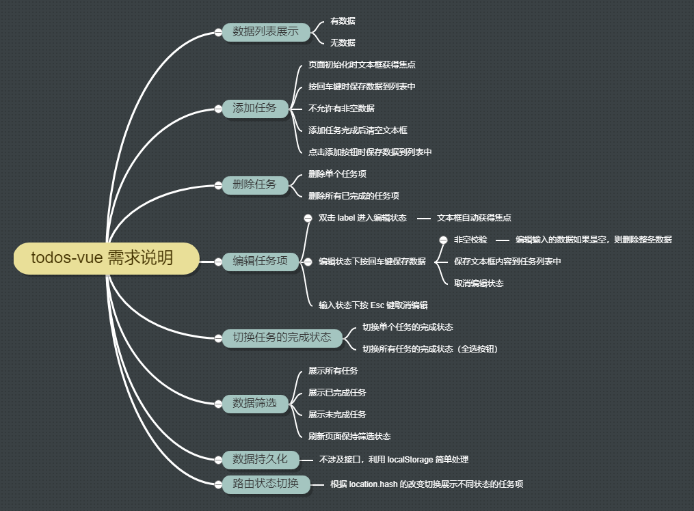

# todos-vue

##  介绍

一个基于 `vue` 的简单的 todos，涵盖了 `Vue.js` 的基础语法。



## 需求说明



### todos-vue 需求说明

- 数据列表展示

  - 有数据

  - 无数据
- 添加任务
  - 页面初始化时文本框获得焦点
  - 按回车键时保存任务到列表中
  - 不允许有非空数据
  - 添加任务完成后清空文本框
  - 点击添加按钮时保存数据到列表中
- 删除任务

  - 删除单个任务项
  - 删除所有已完成的任务项
- 编辑任务

  - 双击 label 进入编辑状态且文本框自动获得焦点
  - 编辑状态下按回车键保存数据
  - 编辑状态下按 Esc 键取消编辑
  - 编辑输入的数据如果是空，则删除整条数据
  - 保存文本框内容到任务列表中
  - 非空校验
- 切换任务的完成状态
  - 切换单个任务的完成状态
  - 切换所有任务的完成状态（全选按钮）
- 数据筛选
  - 展示所有任务
  - 展示已完成任务
  - 展示未完成任务
  - 刷新页面保持筛选状态
- 数据持久化
  - 不涉及接口，利用 localStorage 简单处理
- 路由状态切换
  - 根据 location.hash 的改变切换展示不同状态的任务项

##  知识点总结

1. localStorage

   - 存储在 `localStorage` 的数据可以长期保留
   - `localStorage` 中的键值对总是以字符串的形式存储。

   ```js
   // 增加一个 localStorage 'todos' 数据项
   localStorage.setItem('todos',JSON.stringify(val))
   
   // 读取 localStorage 'todos' 数据项
   localStorage.getItem('todos')
   
   // 移除 localStorage 'todos' 项
   localStorage.removeItem('todos');
   
   // 移除所有的 localStorage 项
   localStorage.clear();
   ```

   

2. 在 `template` 元素上使用 `v-if` 条件渲染分组

   可以用`template` 包裹多个元素，并在`template` 上使用 `v-if`，以此来同时切换多个元素。最终的渲染结果将不包含 `<template>` 元素。

   

3. 自定义指令

   - 新增todo的文本框

     页面初始化一次文本框就聚焦一次，以后不需要聚焦，所以可以用bind或inserted。

     但focus比较特殊，写在bind会有问题，需要写在inserted

   - 双击单个任务项的文本框聚焦

     ```js
     Vue.directive('todo-focus', {
         update(el, binding) {
             if (binding.value) {
                 el.focus()
             }
         }
     })
     ```

4. 侦听器 watch

   为了发现对象内部值（todos）的变化，在选项参数中指定 `deep: true`

   ```js
   watch: {
       // 完整写法
       todos: {
           handler(newValue, oldValue) { // callback 名字必须为 handler
               console.log('todos 从' + oldValue + '变成' + newValue)
           },
           deep: true
       },
           
       // 简写方式
       test(newValue, oldValue) {
           console.log('test 从' + oldValue + '变成' + newValue)
       }
   }
   ```

5. 计算属性 computed

   - 复杂逻辑使用计算属性
   - 计算属性缓存-vs-方法
     - 计算属性是基于它们的响应式依赖进行缓存的，只在相关响应式依赖发生改变时它们才会重新求值
     - 相比之下，每当触发重新渲染时，调用方法将**总会**再次执行函数

   - 计算属性的 getter 与 setter 

     ```js
     computed: {
         // 简写方式，默认只有 getter
         remainingCount() {
             return this.todos.filter(item => !item.completed).length                
         },
         // 完整写法，有 getter 与 setter 
         toggleAll: { 
             get() {
                 return this.todos.every(item => item.completed)
             },
             set() {
                 const value = !this.toggleAll
                 this.todos.forEach(item => {
                     item.completed = value
                 })
             }
      }
     ```

     

6. 筛选数据非常好用的几个数组的方法：

   - filter

     `filter()` 方法创建一个新数组, 其包含通过所提供函数实现的测试的所有元素。

     返回值：

     -  `true`  ：表示该元素通过测试，保留该元素，
     - `false` ：不保留 

   - some (找到一个真值就直接返回true)

     `some ` 方法遍历数组，只要有一个元素满足条件判定就返回 `true`，如果所有元素都不满足条件判定则返回 `false`。

     -  `true` ：只要有一个元素满足条件判定就返回 `true`

     -  `false` ：所有元素都不满足条件判定则返回 `false`

   - every（找到一个假值就直接回返false）

     `every` 方法为遍历数组，如果所有元素都满足条件判定才返回 `true`，只要有一个元素不满足条件判定，就立即返回 `false`。

     -  `true` ：所有元素都满足条件判定

     返回值：

     - `true`：
     -  `false` ：如果某个元素的条件判定为 `false` ，则停止遍历，返回  `false` 

   - splice

     **`splice()`** 方法通过删除或替换现有元素或者原地添加新的元素来修改数组,并以数组形式返回被修改的内容。此方法会改变原数组。

     返回值：由被删除的元素组成的一个数组。如果只删除了一个元素，则返回只包含一个元素的数组。如果没有删除元素，则返回空数组。

   ```js
   const arr = [1,2,3]
   arr.some(item=>item>2) //true
   arr.some(item=>item>3) //false
   arr.filter(item=>item>2) //[3]
   arr.filter(item=>item>3) //[]
   arr.every(item=>item>0)	// true
   arr.every(item=>item>1)	// false
   ```

   >  特别注意：不要在 forEach 循环中删除数据成员，会导致索引错乱

   ```js
   // 这是错误的方式
   this.todos.forEach((item,index) => {
       if (item.completed) {
           this.todos.splice(index,1)
       }
   })
   
   // 正确的方式：手动控制遍历索引
   // 用 for 循环，每删除一个成员就手动更正遍历中的索引
   for (let i = 0; i < this.todos.length; i++) {
       if (this.todos[i].completed) {
           this.todos.splice(i, 1);
           // 删除元素之后，让我们遍历的索引往后倒退一次
           // 因为删除之后，后面的所有元素都会倒退一次
           // 纠正遍历的索引
           i--;
       }
   }
   ```

   

